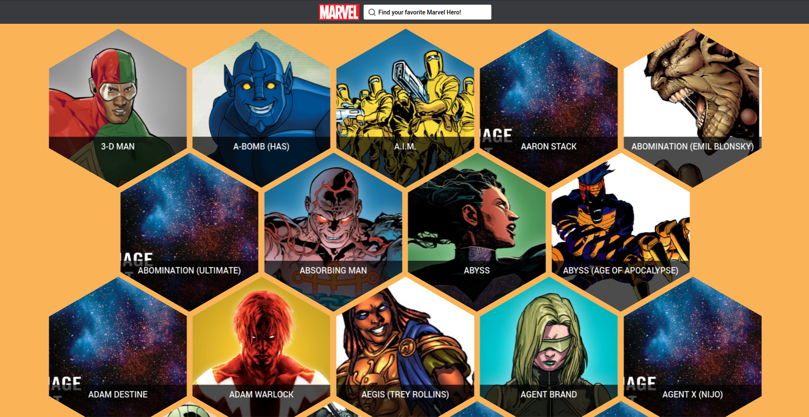

# Marvel Cards em React

Projeto desenvolvido todo em react usando a api da [marvel](https://developer.marvel.com/docs#).

## Considerações sobre o projeto

Algumas considerações sobre o projeto:

- Para a estilização foi usando a lib **[emoticon](https://emotion.sh/docs/introduction)** por conta da sua [velocidade de render](https://github.com/A-gambit/CSS-IN-JS-Benchmarks/blob/master/RESULT.md)
- Para lidar com a api e **side-effect** foi usando **[redux-saga](https://redux-saga.js.org/)**
- Para criar selectors com uma legibilidade melhor foi usando o **[reselect](https://github.com/reduxjs/reselect)**
- E para uma performance melhor, foi usanda a lib **[react-lazyload-fadein](https://github.com/Swizec/react-lazyload-fadein)**, para que as imagens serem carregadas por demanda.



## Rodar o exemplo

Primeiro instale as dependências:

```shell
npm install
```

Para iniciar o projeto basta:

```shell
npm start
```

Para rodar os testes basta:

```shell
npm test
```
